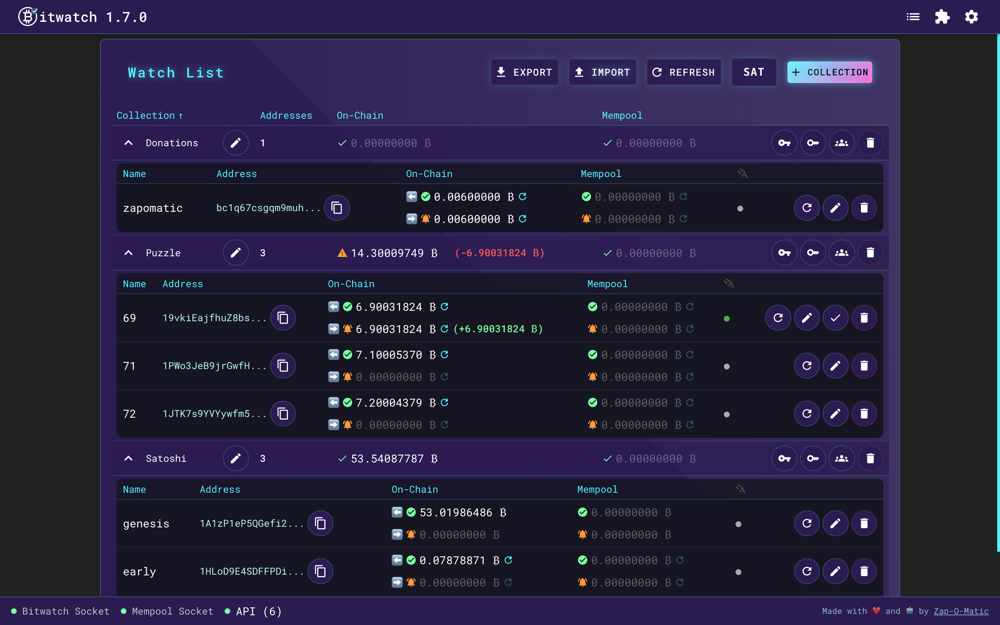

# Bitwatch

> Monitor Bitcoin addresses in the mempool and on-chain using the mempool.space API



## Addresses to Monitor

Some universally interesting addresses to monitor are as follows and are included by default to show how it works:

1. Satoshi Genesis Block Reward - `1A1zP1eP5QGefi2DMPTfTL5SLmv7DivfNa` - This is the original bitcoin genesis block
   reward address. The reward is technically unspendable, so we would never expect to see the base 50 BTC leave this
   address. However, for some mysterious reason, there is constant inbound activity to this address. This makes it a good
   test address for our monitoring tool as the mempool and onchain expectation is regularly invalidated.

## Features

- Real-time monitoring of Bitcoin addresses
- Track both on-chain and mempool activity
- Set and manage balance expectations
- Beautiful cyberpunk crystal theme
- Mobile responsive design
- Telegram notifications for balance changes
- Integration with mempool.space API

## Installation

### As an Umbrel App

1. Click the "Install" button in the Umbrel app store
2. Wait for installation to complete
3. Access Bitwatch through your Umbrel dashboard

### Development Setup

```bash
npm run setup
npm run dev
```

## Configuration

- **API Endpoint**: By default, uses mempool.space API. Can be configured to use your local mempool instance.
- **Update Interval**: Configurable polling interval (default: 10 minutes)
- **Rate Limiting**: Adjustable API rate limiting to prevent overload
- **Telegram Integration**: Optional notifications via Telegram bot

## Usage

1. Add Bitcoin addresses to monitor
2. Set expected balances
3. Get notified of changes
4. Accept or investigate discrepancies

## Some Interesting Addresses to Monitor

1. **Satoshi Genesis Block Reward** - `1A1zP1eP5QGefi2DMPTfTL5SLmv7DivfNa`
   - The original bitcoin genesis block reward address
   - Technically unspendable, but receives frequent transactions from Runestones
   - Great for testing monitoring functionality
2. **The Hal Finney Address** - `12cbQLTFMXRnSzktFkuoG3eHoMeFtpTu3S`
   - The first user-to-user transaction source address in Bitcoin, sent to Hal Finney
3. **A Satoshi Reward Address** - `1HLoD9E4SDFFPDiYfNYnkBLQ85Y51J3Zb1`
   - One of the early block reward payout addresses

Of course, services like [Arkham](https://intel.arkm.com/explorer/entity/satoshi-nakamoto) have a full tracker for Satoshi's addresses, but we want to check our own addresses (and probably privately with our own node)

## Umbrel Home

If running on an Umbrel home, and the desire is to run a sovereign monitoring node (for privacy reasons), the following steps can be taken:

1. Install the Umbrel app
2. Install Fulcrum (faster electrum server, using Electrs will return 502 errors looking up address data on an Umbrel Home or Raspberry Pi device)
3. Install Mempool app
4. Configure Mempool to use Fulcrum as the server
5. Wait for Fulcum/Mempool to sync
6. Configure Bitwatch to use the local Mempool instance
7. Configure Bitwatch to use the Telegram bot

## Contributing

Pull requests are welcome. For major changes, please open an issue first to discuss what you would like to change.

## License

ISC
